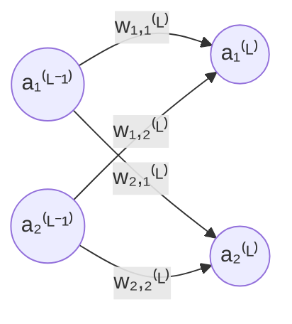
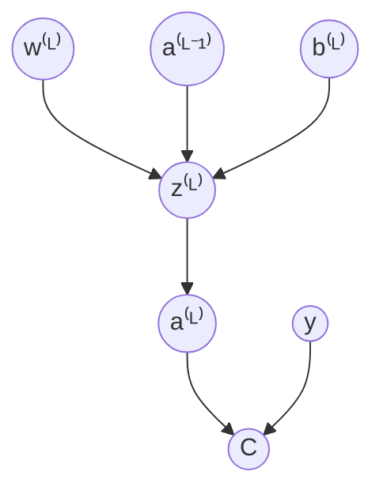

# neural-network.cpp

## Description

A neural network written completely from scratch. No PyTorch. No TensorFlow. Just raw C++ and the mathematics behind the magic.

The network is an implementation of the absolutely goated 3Blues1Brown series on [neural networks](https://www.youtube.com/watch?v=aircAruvnKk&list=PLZHQObOWTQDNU6R1_67000Dx_ZCJB-3pi). The network itself classifies 28 by 28 pixel handwritten single-digit numbers.

## Mathematics

### Defining the network

- Let $x \in [0, 1]^{28 \times 28}$ be one input datum, the input of our network.
- Let $\hat{y} \in [0, 1]^{10}$ be the prediction, the output of our network.
- Let $y \in \{0, 1\}^{10}$ be the true value.

For fixed weights and biases $\theta = (W,B)$ we have,
$$f_\theta: x \mapsto \hat{y}$$

It takes one input datum (e.g. one image) and outputs a prediction.

### Defining activation

- Let the superscript $^{(L)}$ for $L \in \{0, 1, 2, 3\}$ represent the $L$-th layer of the network (our network has 4 layers).
- Let the subscript $_i$ for $i \in \mathbb{N}$ represent the $i$-th vertically stacked neuron for a particular layer (natural numbers include 0).

- Let $a_i^{(L)} \in \mathbb{[0, 1]}$ be the activation in the $i$-th neuron the $L$-th layer of the network.
- Let $w_{i,j}^{(L)} \in \mathbb{R}$ be the weight between:
    - The $j$-th neuron in layer $L - 1$
    - And the $i$-th neuron in layer $L$

- Let $b_i^{(L)} \in \mathbb{R}$ be the bias for neuron $i$ in layer $L$.
- Let $\sigma(x) = \frac{1}{1 + e^{-x}}$ be our sigmoid function with domain and range, $\sigma: \mathbb{R} \mapsto [0, 1]$.
- Let $n_L$ be the total number of neurons in the $L$ layer.

Now we can rigorously define each activation,

$$
\begin{align*}
    a_i^{(L)} & = \sigma(w_{i,0}^{(L)}a_0^{(L-1)} + w_{i,1}^{(L)}a_1^{(L-1)} + ... + w_{i,n-1}^{(L)}a_{n-1}^{(L-1)} + b_i^{(L)}) \\
              & = \sigma\bigg(\sum_{j = 0}^{n-1} w_{i,j}^{(L)}a_j^{(L-1)} + b_i^{(L)}\bigg) \\
              & = \sigma(z_i^{(L)})
\end{align*}
$$

where $n = n_{L-1}$. We also define $z_i^{(L)} = \sum_{j = 0}^{n-1} w_{i,j}^{(L)}a_j^{(L-1)} + b_i^{(L)}$.

Observe that can represent the computation for subsequent activations using matrix operations,

$$
\begin{align*}
\mathbf{a}^{(L)} & = \sigma \left(
\begin{bmatrix}
	w_{0,0}^{(L)} & w_{0,1}^{(L)} & \cdots & w_{0,n-1}^{(L)} \\
	w_{1,0}^{(L)} & w_{1,1}^{(L)} & \cdots & w_{1,n-1}^{(L)} \\
	\vdots        & \vdots        & \ddots & \vdots          \\
	w_{i,0}^{(L)} & w_{i,1}^{(L)} & \cdots & w_{i,n-1}^{(L)}
\end{bmatrix}
\begin{bmatrix}
	a_{0}^{(L-1)} \\
	a_{1}^{(L-1)} \\
	\vdots        \\
	a_{n-1}^{(L-1)}
\end{bmatrix}
+
\begin{bmatrix}
	b_{0}^{(L)} \\
	b_{1}^{(L)} \\
	\vdots      \\
	b_{i}^{(L)}
\end{bmatrix}
\right) \\
& = \sigma(\textbf{W}\textbf{a}^{(L-1)} + \textbf{b}^{(L)})
\end{align*}
$$

### Defining the cost function

The cost function for a particular training example $x \in [0, 1]^{28 \times 28}$ is,

$$C_x = \sum^{n_L-1}_{i=0} (a_i^{(L)} - y_i)^2$$

Let $T \subsetneq [0, 1]^{28 \times 28}$ be the training data, then for some batch of the training data $B \subsetneq T$ we have the cost function with respect to the training batch as,

$$C = \frac{1}{|B|}\sum_{x \in B} C_x$$

Dependency graph for the cost function,

### Back-propagation calculus

Solving for various terms that can we sub into the equations below.

- $\frac{\partial C_x}{\partial a_i^{(L)}} = 2(a_i^{(L)} - y_i)$
- $\frac{\partial a_i^{(L)}}{\partial z_i^{(L)}} = \sigma^\prime(z_i^{(L)}) = \frac{e^{-z_i^{(L)}}}{(1 + e^{-z_i^{(L)}})^2}$
- $\frac{\partial z_i^{(L)}}{\partial w_{i,j}^{(L)}} = a^{L-1}_j$
- $\frac{\partial z_i^{(L)}}{\partial b_{i}^{(L)}} = 1$

Using the chain-rule we have that for a particular training example $x \in [0, 1]^{28 \times 28}$,

$$
\frac{\partial C_x}{\partial a_i^{(L-1)}} =
\begin{cases}
	\underbrace{\sum^{n_L-1}_{j=0} \frac{\partial C_x}{\partial a_j^{(L)}} \frac{\partial a_j^{(L)}}{\partial z_j^{(L)}} \frac{\partial z_j^{(L)}}{\partial a_i^{(L-1)}}}_{\text{Sum of $a_i^{(L-1)}$'s contributions to all of the neurons in $L$}} & \text{If $L-1$ is not the last layer} \\
	\frac{\partial C_x}{\partial a_i^{(L-1)}} = 2(a_i^{(L - 1)} - y_i)                                                                                                                                                                                   & \text{If $L-1$ is the last layer}
\end{cases}
$$

Observe that the above formula can recursively solve for any $\frac{\partial C_x}{\partial a_i^{(L)}}$.

Using the chain rule some more we can solve for the change in our weights and biases,

$$
\frac{\partial C_x}{\partial w_{i,j}^{(L)}} = \frac{\partial C_x}{\partial a_i^{(L)}} \frac{\partial a_i^{(L)}}{\partial z_i^{(L)}} \frac{\partial z_i^{(L)}}{\partial w_{i,j}^{(L)}}
$$

$$
\frac{\partial C_x}{\partial b_i^{(L)}} = \frac{\partial C_x}{\partial a_i^{(L)}} \frac{\partial a_i^{(L)}}{\partial z_i^{(L)}} \frac{\partial z_i^{(L)}}{\partial b_i^{(L)}}
$$

Finally we can extend to multiple data points in the batch for both the weights and the biases.

$$
\frac{\partial C}{\partial w_{i,j}^{(L)}} = \frac{\partial}{\partial w_{i,j}^{(L)}} \left( \frac{1}{|B|} \sum_{x \in B} C_x \right) = \frac{1}{|B|} \sum_{x \in B} \frac{\partial C_x}{\partial w_{i,j}^{(L)}}
$$

$$
\frac{\partial C}{\partial b_i^{(L)}} = \frac{\partial}{\partial b_i^{(L)}} \left( \frac{1}{|B|} \sum_{x \in B} C_x \right) = \frac{1}{|B|} \sum_{x \in B} \frac{\partial C_x}{\partial b_i^{(L)}}
$$

## Gradient vector

We now create our gradient vector filled with all the partial derivatives of the weights and biases and iteratively apply gradient descent,

$$
\nabla C = \begin{bmatrix}
\frac{\partial C}{\partial w_{i,j}^{(L)}} \\
\vdots \\
\frac{\partial C}{\partial b_i^{(L)}} \\
\vdots
\end{bmatrix}
$$
