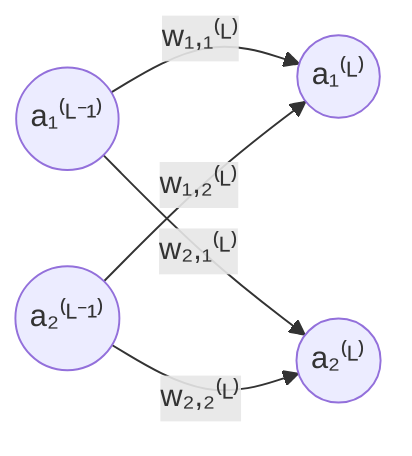

# neural-network.cpp

## Description

A neural network written completely from scratch. No PyTorch. No TensorFlow. Just raw C++ and the mathematics behind the magic.

The network is an implementation of the absolutely goated 3Blues1Brown series on [neural networks](https://www.youtube.com/watch?v=aircAruvnKk&list=PLZHQObOWTQDNU6R1_67000Dx_ZCJB-3pi). The network itself classifies 28 by 28 pixel handwritten single-digit numbers.

## Mathematics

### Defining the network

- Let $x \in [0, 1]^{28 \times 28}$ be one input datum, the input of our network.
- Let $\hat{y} \in [0, 1]^{10}$ be the prediction, the output of our network.
- Let $y \in \{0, 1\}^{10}$ be the true value.

For fixed weights and biases $\theta = (W,B)$ we have,
$$f_\theta: x \mapsto \hat{y}$$

It takes one input datum (e.g. one image) and outputs a prediction.

### Defining the network function

- Let the superscript $^{(L)}$ for $L \in \{0, 1, 2, 3\}$ represent the $L$-th layer of the network (our network has 4 layers).
- Let the subscript $_i$ for $i \in \mathbb{N}$ represent the $i$-th vertically stacked neuron for a particular layer (natural numbers include 0).

- Let $a_i^{(L)}$ be the activation in the $i$-th neuron the $L$-th layer of the network.
- Let $w_{i,j}^{(L)}$ be the weight between:
    - The $j$-th neuron in layer $L - 1$
    - And the $i$-th neuron in layer $L$

- Let $b_i^{(L)}$ be the bias for neuron $i$ in layer $L$
- Let $\sigma(x) = \frac{1}{1 + e^{-x}}$ be our sigmoid function

Now we can rigorously define
