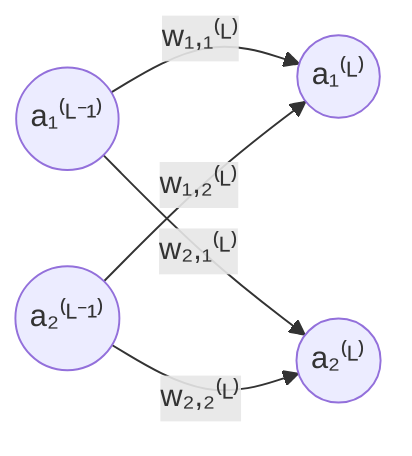
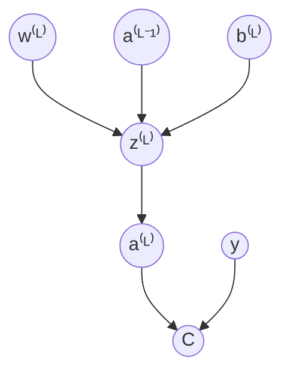

# neural-network.cpp

## Description

A neural network written completely from scratch. No PyTorch. No TensorFlow. Just raw C++ and the mathematics behind the magic.

The network is an implementation of the absolutely goated 3Blues1Brown series on [neural networks](https://www.youtube.com/watch?v=aircAruvnKk&list=PLZHQObOWTQDNU6R1_67000Dx_ZCJB-3pi). The network itself classifies 28 by 28 pixel handwritten single-digit numbers.

## Mathematics

### Defining the network

- Let $x \in [0, 1]^{28 \times 28}$ be one input datum, the input of our network.
- Let $\hat{y} \in [0, 1]^{10}$ be the prediction, the output of our network.
- Let $y \in \{0, 1\}^{10}$ be the true value.

For fixed weights and biases $\theta = (W,B)$ we have,
$$f_\theta: x \mapsto \hat{y}$$

It takes one input datum (e.g. one image) and outputs a prediction.

### Defining activation

- Let the superscript $^{(L)}$ for $L \in \{0, 1, 2, 3\}$ represent the $L$-th layer of the network (our network has 4 layers).
- Let the subscript $_i$ for $i \in \mathbb{N}$ represent the $i$-th vertically stacked neuron for a particular layer (natural numbers include 0).

- Let $a_i^{(L)} \in [0, 1]$ be the activation in the $i$-th neuron the $L$-th layer of the network.
- Let $w_{i,j}^{(L)} \in \mathbb{R}$ be the weight between:
    - The $j$-th neuron in layer $L - 1$
    - And the $i$-th neuron in layer $L$



- Let $b_i^{(L)} \in \mathbb{R}$ be the bias for neuron $i$ in layer $L$.
- Let $\sigma(x) = \frac{1}{1 + e^{-x}}$ be our sigmoid function with domain and range, $\sigma: \mathbb{R} \mapsto [0, 1]$.
- Let $n_L$ be the total number of neurons in the $L$ layer.

Now we can rigorously define each activation,

$$
\begin{align*}
    a_i^{(L)} & = \sigma(w_{i,0}^{(L)}a_0^{(L-1)} + w_{i,1}^{(L)}a_1^{(L-1)} + ... + w_{i,n-1}^{(L)}a_{n-1}^{(L-1)} + b_i^{(L)}) \\
              & = \sigma\bigg(\sum_{j = 0}^{n-1} w_{i,j}^{(L)}a_j^{(L-1)} + b_i^{(L)}\bigg) \\
              & = \sigma(z_i^{(L)})
\end{align*}
$$

where $n = n_{L-1}$. We also define $z_i^{(L)} = \sum_{j = 0}^{n-1} w_{i,j}^{(L)}a_j^{(L-1)} + b_i^{(L)}$.

Observe that we can represent the computation for subsequent activations using matrix operations,

$$
\begin{align*}
\textbf{a}^{(L)} & = \sigma \left(
\begin{bmatrix}
	w_{0,0}^{(L)} & w_{0,1}^{(L)} & \cdots & w_{0,n-1}^{(L)} \\
	w_{1,0}^{(L)} & w_{1,1}^{(L)} & \cdots & w_{1,n-1}^{(L)} \\
	\vdots        & \vdots        & \ddots & \vdots          \\
	w_{i,0}^{(L)} & w_{i,1}^{(L)} & \cdots & w_{i,n-1}^{(L)}
\end{bmatrix}
\begin{bmatrix}
	a_{0}^{(L-1)} \\
	a_{1}^{(L-1)} \\
	\vdots        \\
	a_{n-1}^{(L-1)}
\end{bmatrix}
+
\begin{bmatrix}
	b_{0}^{(L)} \\
	b_{1}^{(L)} \\
	\vdots      \\
	b_{i}^{(L)}
\end{bmatrix}
\right) \\
& = \sigma(\textbf{W}\textbf{a}^{(L-1)} + \textbf{b}^{(L)})
\end{align*}
$$

### Defining the cost function

The cost function for a particular training example $x \in [0, 1]^{28 \times 28}$ will be defined by the Mean Squared Error (MSE),

$$C_x = \sum^{n_L-1}_{i=0} (a_i^{(L)} - y_i)^2$$

where $L$ is the last layer.

Let $T \subsetneq [0, 1]^{28 \times 28}$ be the training data, then for some batch of the training data $B \subsetneq T$ we have the cost function with respect to the training batch as,

$$C = \frac{1}{|B|}\sum_{x \in B} C_x$$

Dependency graph for the cost function,



### Back-propagation calculus

Solving for various terms that we can use to substitute into the equations below.

- $\frac{\partial C_x}{\partial a_i^{(L)}} = 2(a_i^{(L)} - y_i)$
- $\frac{\partial a_i^{(L)}}{\partial z_i^{(L)}} = \sigma^\prime(z_i^{(L)}) = \frac{e^{-z_i^{(L)}}}{(1 + e^{-z_i^{(L)}})^2}$
- $\frac{\partial z_i^{(L)}}{\partial w_{i,j}^{(L)}} = a_j^{(L-1)}$
- $\frac{\partial z_i^{(L)}}{\partial b_{i}^{(L)}} = 1$
- $\frac{\partial z_i^{(L)}}{\partial a_j^{(L-1)}} = w_{i,j}^{(L)}$

Using the chain-rule we have that for a particular training example $x \in [0, 1]^{28 \times 28}$,

$$
\frac{\partial C_x}{\partial a_i^{(L-1)}} =
\begin{cases}
	\underbrace{\sum^{n_L-1}_{j=0} \frac{\partial C_x}{\partial a_j^{(L)}} \frac{\partial a_j^{(L)}}{\partial z_j^{(L)}} \frac{\partial z_j^{(L)}}{\partial a_i^{(L-1)}}}_{\text{Sum of $a_i^{(L-1)}$'s contributions to all of the neurons in $L$}} & \text{If $L-1$ is not the last layer} \\
	\frac{\partial C_x}{\partial a_i^{(L-1)}} = 2(a_i^{(L - 1)} - y_i)                                                                                                                                                                                   & \text{If $L-1$ is the last layer}
\end{cases}
$$

Observe that the above formula can recursively solve for any $\frac{\partial C_x}{\partial a_i^{(L)}}$.

Using the chain rule some more we can solve for the change in our weights and biases,

$$
\frac{\partial C_x}{\partial w_{i,j}^{(L)}} = \frac{\partial C_x}{\partial a_i^{(L)}} \frac{\partial a_i^{(L)}}{\partial z_i^{(L)}} \frac{\partial z_i^{(L)}}{\partial w_{i,j}^{(L)}}
$$

$$
\frac{\partial C_x}{\partial b_i^{(L)}} = \frac{\partial C_x}{\partial a_i^{(L)}} \frac{\partial a_i^{(L)}}{\partial z_i^{(L)}} \frac{\partial z_i^{(L)}}{\partial b_i^{(L)}}
$$

Finally we can extend to multiple data points in the batch for both the weights and the biases.

$$
\frac{\partial C}{\partial w_{i,j}^{(L)}} = \frac{\partial}{\partial w_{i,j}^{(L)}} \left( \frac{1}{|B|} \sum_{x \in B} C_x \right) = \frac{1}{|B|} \sum_{x \in B} \frac{\partial C_x}{\partial w_{i,j}^{(L)}}
$$

$$
\frac{\partial C}{\partial b_i^{(L)}} = \frac{\partial}{\partial b_i^{(L)}} \left( \frac{1}{|B|} \sum_{x \in B} C_x \right) = \frac{1}{|B|} \sum_{x \in B} \frac{\partial C_x}{\partial b_i^{(L)}}
$$

### Gradient vector

We now create our gradient vector filled with all the partial derivatives of the weights and biases and iteratively apply gradient descent,

$$
\nabla C = \begin{bmatrix}
\frac{\partial C}{\partial w_{i,j}^{(L)}} \\
\vdots \\
\frac{\partial C}{\partial b_i^{(L)}} \\
\vdots
\end{bmatrix}
$$

### Matrix batching

Matrix batching leverages matrix multiplication, a heavily optimized operation for modern CPUs and GPUs. Suppose the batch contains $m$ training samples,

$$
B = \{x_1, x_2, \dots, x_m\}
$$

Instead of a single activation vector, we now stack activations horizontally, one for each training samples,

$$
\textbf{A}^{(L)} =
\begin{bmatrix}
| & | & & | \\
\textbf{a}^{(L)}_1 &
\textbf{a}^{(L)}_2 &
\cdots &
\textbf{a}^{(L)}_m \\
| & | & & |
\end{bmatrix}
\in [0, 1]^{n_{L-1} \times m}
$$

Same applies to our biases,

$$
\textbf{B}^{(L)} =
\begin{bmatrix}
| & | & & | \\
\textbf{b}^{(L)} &
\textbf{b}^{(L)} &
\cdots &
\textbf{b}^{(L)} \\
| & | & & |
\end{bmatrix}
\in \mathbb{R}^{n_L \times m}
$$

#### Forward pass

Now we can represent our pre-activation/weighted sum as,

$$
\begin{align*}
\textbf{Z}^{(L)}
& =
\textbf{W}^{(L)}\textbf{A}^{(L-1)} + \textbf{B}^{(L)} \\
& =
\begin{bmatrix}
| & | & & | \\
\textbf{z}^{(L)}_1 &
\textbf{z}^{(L)}_2 &
\cdots &
\textbf{z}^{(L)}_m \\
| & | & & |
\end{bmatrix}
\in \mathbb{R}^{n_{L-1} \times m}
\end{align*}
$$

And our next activations as,

$$
\textbf{A}_i^{(L)} = \sigma(\textbf{Z}_i^{(L)})
$$

#### Error term

Let $\delta_i = \frac{\partial C}{\partial z_i}$ be the error term.

$$
\begin{align*}
\delta_i^{(L)}
& =
\frac{\partial C_x}{\partial a_i^{(L)}}
\frac{\partial a_i^{(L)}}{\partial z_i^{(L)}} \\
& =
\frac{\partial C_x}{\partial a_i^{(L)}}
\sigma^\prime(z_i^{(L)}) \\
\mathbf{\Delta}^{(L)}
& =
\frac{\partial C_x}{\partial \textbf{A}^{(L)}}
\odot
\sigma^\prime(\textbf{Z}^{(L)}) \\
& =
\begin{bmatrix}
| & | & & | \\
\boldsymbol{\delta}^{(L)}_1 &
\boldsymbol{\delta}^{(L)}_2 &
\cdots &
\boldsymbol{\delta}^{(L)}_m \\
| & | & & |
\end{bmatrix}
\in \mathbb{R}^{n_L \times m}
\end{align*}
$$

#### Backward pass

$$
\begin{align*}
\frac{\partial C_x}{\partial a_i^{(L-1)}}
& =
\sum_{j=0}^{n_L - 1}
\frac{\partial C_x}{\partial a_j^{(L)}}
\frac{\partial a_j^{(L)}}{\partial z_j^{(L)}}
\frac{\partial z_j^{(L)}}{\partial a_i^{(L-1)}} \\
& =
\sum_{j=0}^{n_L - 1}
\delta_j^{(L)}
w_{j,i}^{(L)} \\
\frac{\partial C_x}{\partial \textbf A^{(L-1)}}
& =
(\textbf W^{(L)})^T
\mathbf\Delta^{(L)}
\end{align*}
$$

#### Weight gradient

$$
\begin{align*}
\frac{\partial C_x}{\partial w_{i,j}^{(L)}}
& =
\frac{\partial C_x}{\partial a_i^{(L)}} \frac{\partial a_i^{(L)}}{\partial z_i^{(L)}} \frac{\partial z_i^{(L)}}{\partial w_{i,j}^{(L)}} \\
& =
\delta_i^{(L)} a_j^{(L-1)} \\
\frac{\partial C}{\partial w_{i,j}^{(L)}}
& =
\frac{1}{|B|} \sum_{x \in B} \frac{\partial C_x}{\partial w_{i,j}^{(L)}} \\
& =
\frac{1}{|B|} \sum_{x \in B} \delta_i^{(L)} a_j^{(L-1)} \\
& =
\frac{1}{|B|}(\mathbf{\Delta}^{(L)} (\textbf{A}^{(L-1)})^T)_{ij} \\
\frac{\partial C}{\partial \textbf{W}^{(L)}}
& =
\frac{1}{|B|}
\mathbf{\Delta}^{(L)}
(\textbf{A}^{(L-1)})^T
\end{align*}
$$

#### Bias gradient

$$
\begin{align*}
\frac{\partial C_x}{\partial b_i^{(L)}}
& =
\frac{\partial C_x}{\partial a_i^{(L)}} \frac{\partial a_i^{(L)}}{\partial z_i^{(L)}} \frac{\partial z_i^{(L)}}{\partial b_i^{(L)}} \\
& =
\delta_i^{(L)} \\
\frac{\partial C}{\partial b_i^{(L)}}
& =
\frac{1}{|B|} \sum_{x \in B} \frac{\partial C_x}{\partial b_i^{(L)}} \\
& =
\frac{1}{|B|} \sum_{x \in B} \delta_i^{(L)}
\end{align*}
$$

#### Mean Squared Error

$$
C = \frac{1}{m}||(\textbf{A}^{(L)} - \textbf{Y})^2||_F
$$

where $\textbf Y$ is a matrix of the labels.

Differentiating gives,

$$
\frac{\partial C}{\partial \mathbf A^{(L)}} = \frac{2}{m} (\mathbf A^{(L)} - \mathbf Y)
$$

## Results

Accuracy of the neural network was **83.53%**.

### Per-digit matrics

| Digit | Precision | Recall | F1 Score |
| ----: | --------: | -----: | -------: |
|     0 |    93.26% | 86.87% |   89.95% |
|     1 |    97.00% | 92.66% |   94.78% |
|     2 |    80.49% | 82.98% |   81.72% |
|     3 |    83.13% | 78.17% |   80.58% |
|     4 |    87.14% | 79.81% |   83.32% |
|     5 |    71.01% | 81.65% |   75.96% |
|     6 |    88.60% | 83.86% |   86.16% |
|     7 |    86.85% | 85.44% |   86.14% |
|     8 |    67.01% | 79.61% |   72.77% |
|     9 |    77.78% | 81.75% |   79.72% |

### Confusion matrix

| Actual \ Predicted |       0 |        1 |       2 |       3 |       4 |       5 |       6 |       7 |       8 |       9 |
| ------------------ | ------: | -------: | ------: | ------: | ------: | ------: | ------: | ------: | ------: | ------: |
| **0**              | **913** |        0 |      15 |       7 |       3 |      40 |      27 |       4 |      31 |      11 |
| **1**              |       0 | **1099** |      18 |       4 |       6 |       7 |       3 |      15 |      21 |      13 |
| **2**              |       7 |        8 | **829** |      37 |      11 |       5 |      27 |      31 |      32 |      12 |
| **3**              |       8 |        5 |      45 | **838** |       1 |      68 |       3 |       6 |      83 |      15 |
| **4**              |       2 |        3 |      27 |       5 | **854** |      35 |      21 |      22 |      20 |      81 |
| **5**              |       8 |        1 |       3 |      34 |       5 | **632** |      18 |       4 |      54 |      15 |
| **6**              |      24 |        6 |      34 |      13 |      15 |      35 | **847** |       2 |      30 |       4 |
| **7**              |      11 |        0 |      15 |      27 |       4 |      21 |       1 | **892** |      20 |      53 |
| **8**              |       5 |       11 |      37 |      32 |      11 |      40 |       8 |       3 | **652** |      20 |
| **9**              |       1 |        0 |       7 |      11 |      70 |       7 |       1 |      48 |      30 | **784** |

## Tools and Technology

- **C++23** - Currently my favourite programming language
- **CMake** - Generates Ninja build files
- **Ninja** - Similar to Make, but designed to be autogenerated and optimized for speed
- **vcpkg** - Microsoft's open-source C++ package manager
- **GTest** - Google's unit testing framework
- **Docker** - For reproducible build and execution environments
- **clang-uml** - Auto generated PlantUML diagrams
- **clang-tidy** - LLVM's linter, didn't like the suggestions so I didn't use it
- **clang-format** - LLVM's formatter

## Commands

### Building and Running the Project

```bash
# creates a reproducible environment to build and run code
docker compose up -d

# gets a bash shell in the container
docker container exec -it neural-network-container /bin/bash

# holds all build artifacts
mkdir build

# prepare the project so it can be built
cmake --preset default

# compiling the code
cmake --build build

./build/neural-network
./build/testing-suite
```

### Generating the UML Diagrams

```bash
# generate build files and compile_commands.json file for code analyzers
cmake -B build -DCMAKE_EXPORT_COMPILE_COMMANDS=ON

# generates the plant uml markdown
clang-uml

# generates the encoding to be added to www.plantuml.com/plantuml/svg/<encoding>
plantuml -encodeurl docs/*.puml
```

## UML Diagram

![UML Diagram of the Neural Network](https://www.plantuml.com/plantuml/svg/hLbRRzis57xNhz3oK3Xpb8gahaOReDso8a2QXyNOgw3Oh2DKbWn9Njfi--yxr9MK3ctNMrkq4G_FXUTyFFp8hjAuBCsBibel5d_oLPKNxvOt5sPSchz4jarSZxeESma96VmKsfxZ6AjQHISs_pAYoFYddQKONkVxfvHBrWcZWMUxDYMXpMoV-2wLhIDYp7gI9LKIfyahBw8qAQjt-wnCDXbVcqbM3TvipsLkwDW4meOFHab096-O-C1QFiRLwfd3zwyyA_bz_9qNaYlYCkfJGXpuAt1TpwM-x0eH7t3rc6ntATTvycW89dng1nGguJ9FMHGYnZmznMMoYf8lPLNmUFjkzHnBFWXZZXSuRiXy9uJVn6DCBXCY7ldu75T5yaq15h4POGJm4Ze1WmZTC5HAFnM3pNbZQ5P2hQFABFANyifiFrPvMbwQ2_FFF5aRrzV6FD_n8eRypIwb-V9qCNjflZbfvYhFoWhcD_yABU52-9mDmaR1c8kufiEG44ieHCEGjQtNKuye6z2mX0rfPfzA17S364BYCCUbWUrJttCypoCA612nIEfWQTRiK3FbSP4bsIQ2jF0-4K_2TIG--g4as-qhTIZVLzsOKewdUFNr9IxMioOjBIJQbc2-CJT5l8uQvSi-qUeiO_ubBmxPgCFHQbj5dAtphGZpAObBBchK1YY9NdYoUQuacQZRi7IvUeqLCV97NJZ3QlAnYg54OdWSW99NCQ6H65QRDArY6nGYcWBZWU-BE7tWrKjUV9KQXUDxhXEoq74SqRH9O2kDOYeMs52C_G0yZlTbCnM8g-Sh-zOw2IXfNbQzricm6CEfAk8aEwXrPMgaLLniU2M3PAw2fD7he58ljXnlTAcZ6_C9E1eBBKJ6lNHobiA10lNp6753OjF0Txr0RgY8UDIafyVCODoXDfnIZkruS0PxpBC3nJWY7ZMM_zmlcXsczeah4mFafRGVL_aMvl6eLggTe-PUXsQDQhuU26AYEa9ZhzEZi7DnNZkozhkr04YhWov7dnZ5H6Vx71jrLppM_xfXVVkoNYUp9u346nfn0fzIQZikK0yI1jGE5MgAYASDxN_iKshwH7ywaa6yQ-t1Pn1LDmXWi7OrddvbjYDjWpgXYiTRqxZtT4ubDkTw3W5kuS4f0amze8meR6ugxfeFp_PRy-9k6s_uylkEIsoTE2G8Goy86H2M4AeOD9DrKh2u_Ft3tSFTmoTZUVku5FzszdzBqh7va506NSiFAG7wwZFgoEQdKZ1_z_d3fzj7u_x3nzlxno4hTV3bO3geVuN0XWc5FmvZChN5n0AOZPLPdmap4Jz55VpOdgTVO17bzxBYsyLY5rVF9cpYE5edXVdUl7Why5pkuXL_AuOlr5xADm2S4OkDaggXlHCUA-hBg62oF5lhrIp0LxJDOCT48ZGHaYx-zZ14L_6cNyUmDO2HPxNHMLSvKtpLrYHYNU_Uzj8oeTt3AiJUFSp7-xbM7NLP-yxYBU-tnJXiiM-UU7hIp8xB3rv6J784fSNYNjXE-Rh-7hPPG0AuE1BFzvdZ0tG0dV8sGyJDDflNgngwRxU1WNG8Hsre0HQ9MlC1v8owBFJXRcRRS3dpGf_9Z00J2v1tDwsVthTjJ3KFMCYhPruCjNhAytHG-taCHbD9b7oNcyzdbnF8zjSsUR2Df5cmYE0bun8KJvXyrNxVPkjbl95ESIvOXn19ntVvDTb5po21fgjUCYJeHHDqmz6wvj_asqVQBhtn82HACXI08lRgo0UQsQreZ81cJJ84RRWuGhiDg4jjIZpb6e69kqwlVTAvllxxHl_Qf7qmkRw-qTzw3sWTTuQycNJEK2PyGEkOC_IX8xSi_VFQmknU3GpjfRwF5djbqMhrRh6x0hZjMDm95h0oWuMMC9uVWimlpxUYtBODxVMtpo9sjJgkfStz8ItqaLAhrIqKHJeijALsXZOP0q1rqQ9tknz2oc4B9o3bB0CJf9nbvLMrW5mfXd8ZRzb7jRJbFk8BeTidQ6bBZ6WDq4BwsXXQ6By_3YsK2G-PGVZ_2Le8hJ-gXJvm7_U5KI0j3xEikVvseDKQy8baU64slCxGCgwZJb6jFYtOMN_0rut-VYEQRiqtzFhzKh7_JX0RMc97vrkHET49Lh2QT5O6wcNy2m00)
